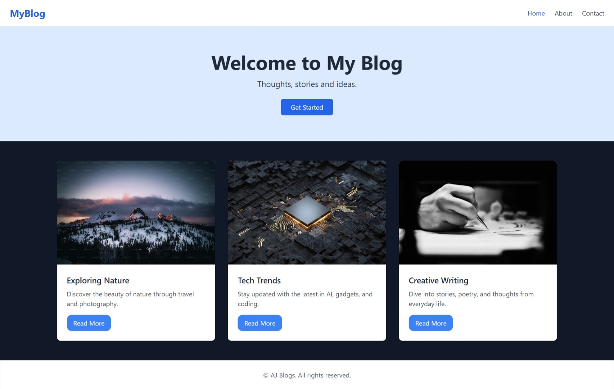
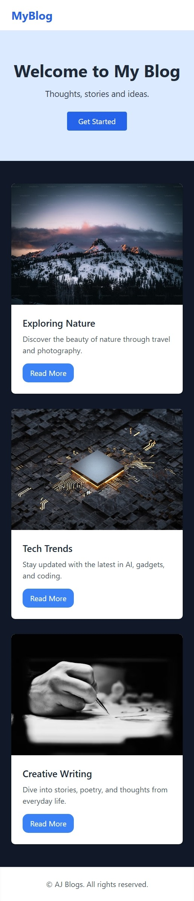

# 🌐 Responsive Blog Page using Tailwind CSS

This project is a simple and clean *responsive blog layout* built entirely with *Tailwind CSS via CDN*. It demonstrates how to use Tailwind’s utility classes to build modern, mobile-friendly layouts with minimal custom CSS.

---

## 🚀 Features

- ✅ Fully responsive design (mobile → desktop)
- ✅ Flexbox-based navigation bar
- ✅ Beautiful hero section with call-to-action
- ✅ Responsive grid for blog posts
- ✅ Reusable blog card design
- ✅ Hover effects, rounded borders, and shadows
- ✅ Semantic HTML structure
- ✅ Built using *Tailwind CSS CDN* (no setup required)

---

## 📸 Preview




---

## 🛠 Tech Stack

- HTML5
- Tailwind CSS (via CDN)

---


## ✍ How to Use

1. *Clone this repository:*
   ```bash
   git clone https://github.com/Anuj-ml/Responsive-tailwind-blog-page.git
2. *Open the project folder:*

   ```bash
   cd Responsive-tailwind-blog-page
3. *Open the HTML file in your browser:*
   ```bash
   start tailwind.html

Or just double-click index.html

---

## 🎨 Customization Ideas

- Add a mobile hamburger menu for better UX
- Use Tailwind’s dark: classes for dark mode support
- Connect to a CMS or JSON file for dynamic content
- Replace blog cards with real blog posts from your backend or API

---

## 📚 Inspiration

This layout is inspired by modern blogging platforms and UI design trends. It’s a perfect starting point for personal blogs, portfolios, or landing pages.

---

## 🤝 Contribution

Contributions are welcome! Feel free to fork the repo, improve it, and create a pull request.

---

## 📄 License

This project is open-source and available under the [MIT License](LICENSE).

---
